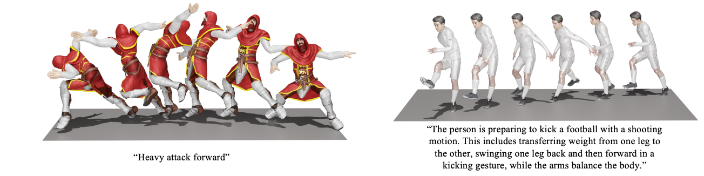

# ScaMo
Pytorch implementation of paper "ScaMo: Exploring the Scaling Law in Autoregressive Motion Generation Model"


[[Project Page]]() [[Paper]]()


<p align="center">

</p>


## Release Log
* 2024/12/06 Initialize the project and release the inference code.

## Table of Content
* [1. Installation](#1-installation)
* [2. Quick Start](#2-quick-start)
* [3. Transform the output vector to bvh](#3-transform-the-output-vector-to-bvh)
* [4. Contribute](#4-contribute)
* [5. Acknowledgement](#5-acknowledgement)

 
## 1. Installation

### 1.1. Environment

```bash
conda env create -f environment.yml
conda activate ScaMo
```

The code was tested on Python 3.8 and PyTorch 2.0.0.

### 2.2. Dependencies

```bash
bash dataset/prepare/download_model.sh
```
Download google flan-t5-xl model from huggingface.
```bash
bash dataset/prepare/download_t5.sh
```


## 3. Quick Start

A quick start guide of how to inference ScaMo.
```python
python inference_generation_hf.py --nb-code 65536 --quantizer FSQ --pretrained_llama 3B --text_encode flan-t5-xl
```


## 4. Transform the output vector to bvh


You should change the folder path correctly. Here is an example:

```bash
python3 visualization/joints2bvh.py
```
Note the process may lead to wrong bone rotation, due to the ik. We are training a new model with a rotation-based representation to solve this problem.

## 5. Contribute
We try to scale the dataset and model. However, we still do not observe the emerging abilities and have a long way to go. We believe our model can "eat" more data. If you have any open-sourced data, feel free to contact me. I can contribute to convert the motion data to same format in this paper to train a better model. 


### 6. Acknowledgement
We appreciate helps from :  

* public code like [t2m-gpt](https://github.com/Mael-zys/T2M-GPT), [momask](https://github.com/EricGuo5513/momask-codes), [text-to-motion](https://github.com/EricGuo5513/text-to-motion), [TM2T](https://github.com/EricGuo5513/TM2T), [MDM](https://github.com/GuyTevet/motion-diffusion-model), [MotionDiffuse](https://github.com/mingyuan-zhang/MotionDiffuse) etc.


